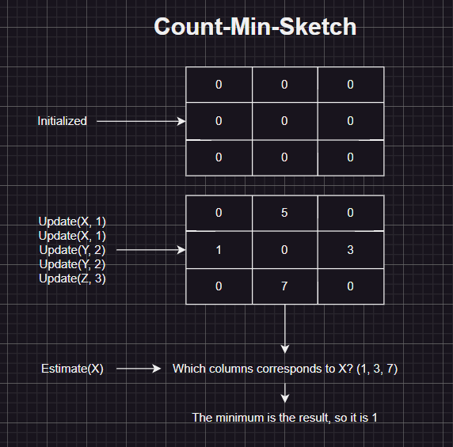

# Count-Min Sketch

A data structure for frequency analysis.

## How it works?

It's simply works on a two dimensional array, however we're using a single Vec<u64> here, because through trivial computatins we can use it as a two dimensional array and get rid of performance penalty. 

We only have two operation, update and estimate. Update just selects a number of columns and increase them as much as the frequency. Estimate once again selects the same rows, and selects the lowest columns as the result.

